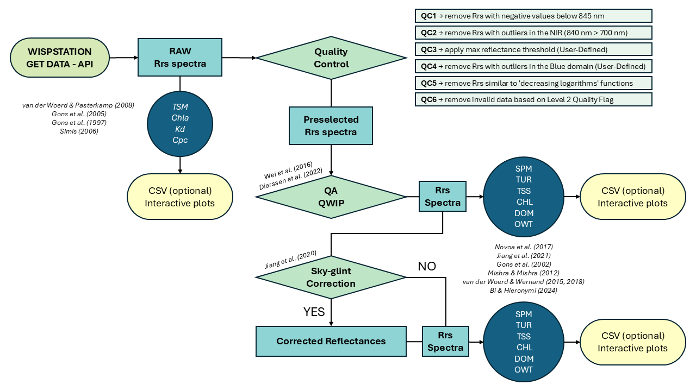
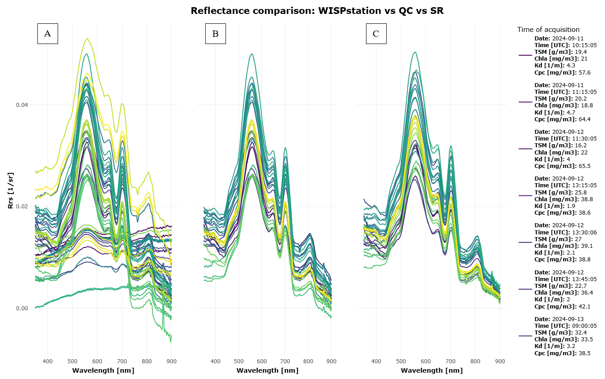
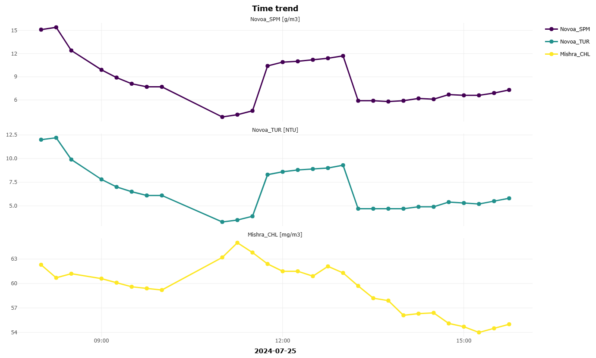
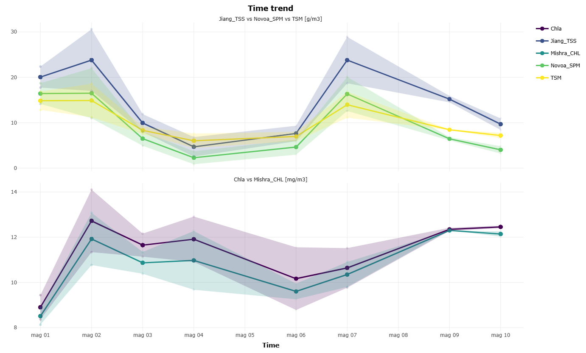

**WISP.data**
===================
<!-- badges: start -->
[](https://doi.org/10.5281/zenodo.16893167)


[](https://app.codecov.io/gh/oggioniale/WISP.data)
[](https://github.com/oggioniale/WISP.data/actions/workflows/R-CMD-check)
[](https://lifecycle.r-lib.org/articles/stages.html)
<!-- badges: end -->

## Summary

`WISP.data` is an R package designed to automate the download, quality control (QC), processing, analysis, and visualization of spectral data collected by WISPstation fixed spectroradiometers.
Developed by Water Insight B.V. (Ede, The Netherlands) as an evolution of the handheld WISP-3 system (Hommersom et al., 2012), the WISPstation is an autonomous above water instrument installed at fixed position that records radiance and irradiance across a wavelength range of 350 to 900 nm, with a spectral resolution of 4.6 nm at high frequency (e.g. every 15 minutes, during daytime).
This R package serves as a crucial bridge between Water Insight API services and the scientific users, enabling the conversion of native reflectance measurements into robust, analysis-ready products through fully reproducible and transparent workflows, from an Open Science perspective.

The WISPstation operates with 8 specialized channels to optimize data collection:

* **Dual-directional radiance**: two sets of sensors (looking NNW and NNE) measure upwelling radiance ($L_u$) and sky radiance ($L_{sky}$) at 40° angles.
* **Irradiance and calibration**: includes two downwelling irradiance ($E_s$) channels and two unexposed “dark” channels to assess sensor degradation over time.

The system automatically selects the best-oriented sensor set based on the Sun's position, maintaining a relative azimuth angle of approximately 135°.

The primary aim of `WISP.data` is the derivation of Remote Sensing Reflectance (Rrs), defined as the ratio between water-leaving radiance ($L_w$) and downwelling irradiance ($E_s$):

$$\text{Rrs}(\lambda) = \frac{L_w(\lambda)}{E_s(\lambda)} = \frac{L_u(\lambda) - \rho \cdot L_{sky}(\lambda)}{E_s(\lambda)}$$

Where $\rho$ is the Fresnel reflection coefficient, $L_u$ is the total upwelling radiance and $L_{sky}$ is the sky radiance contributing to surface reflections.

The package handles the complex transition from total upwelling radiance ($L_u$), which includes unwanted sky-glint and sun-glint, to the pure water-leaving signal ($L_w$) by integrating $L_{sky}$ and $E_s$ measurements into standardized atmospheric correction algorithms.

`WISP.data` provides a modular set of R functions for:

* downloading WISPstation data;
* performing automated and reproducible quality control (QC);
* performing automated skyglint removal (SR);
* applying different algorithms to spectral measurements;
* visualizing spectral and derived data products.

This makes `WISP.data` an ideal solution for operational water quality monitoring, long-term research applications, and integration into large-scale environmental data pipelines.

## Statement of need

The WISPstation is a fixed spectrometer that plays a crucial role in the continuous monitoring of water quality; beyond providing high-frequency spectral measurements, it delivers specialized water quality products derived through various algorithms (Gons et al., 1997, 2005; Simis, 2006; van der Woerd & Pasterkamp, 2008), essential for environmental observation, ecosystem assessment, and long-term trend analysis. 

However, the effective management and scientific use of these spectral data and derived products present several significant challenges.
Data retrieval through API services is often labor-intensive and technically demanding, especially for users without advanced programming experience. 
In addition, native spectral measurements could be affected by radiometric issues making the implementation of consistent and rigorous quality control procedures essential. 
Without rigorous filtering and validation protocols, derived products can be unreliable or scientifically misleading.
A further critical barrier lies in the interpretation of spectral signatures themselves. 
For non-expert users, it is difficult to assess the physical and optical reliability of reflectance spectra, identify anomalous signals, or distinguish between instrument geometry artifacts and real environmental variability. 
Moreover, the application of third-party bio-optical algorithms for the estimation of water quality parameters typically requires substantial domain knowledge, careful parameterization, and consistent preprocessing workflows, which are rarely standardized across studies.

The scientific validity and operational reliability of WISPstation measurements have been demonstrated in several studies, ranging from the detection of climate-driven chlorophyll-a changes during extreme events (Free et al., 2021) to the analysis of phytoplankton spatio-temporal dynamics in Lake Trasimeno (Bresciani et al., 2020).
Despite these successful applications, the processing of WISPstation data has been labor-intensive and time-consuming.
Prior to the development of `WISP.data`, researchers often had to manually inspect individual spectral signatures to identify outliers before the data could be used to estimate water quality parameter. 
This manual quality control process is prone to subjectivity and significantly limits the scalability of high-frequency monitoring. 

`WISP.data` addresses these challenges by delivering an integrated, transparent, reproducible, and user-oriented software ecosystem that unifies data acquisition, quality control, and product generation within a single R-based framework. 
By lowering technical and methodological barriers, the package enables both expert and non-expert users to transform native WISPstation measurements into reliable, scientifically consistent water quality products, fostering reproducibility, comparability, and broader adoption of spectral monitoring technologies in aquatic research and operational monitoring.

## Installation

You can install the development version of WISP.data directly from GitHub.  
The following commands will automatically install all required dependencies:

```r
# Install remotes if not already available
if (!require("remotes")) install.packages("remotes")

# Install WISP.data and dependencies
remotes::install_github("oggioniale/WISP.data", dependencies = TRUE)
```

## Functions

For a detailed description of each function, please visit [Reference page](https://oggioniale.github.io/WISP.data/reference/index.html) of documentation.

## Quick start

To view a complete example of WISP.data a [vignette](https://oggioniale.github.io/WISP.data/articles/exampleOfFunctions.html) has created.

## Shiny App

A ShinyApp has been created to reproduce some of the package's features through a simple user interface.
The function [`WISP_runApp()`](https://oggioniale.github.io/WISP.data/reference/wisp_runApp.html) can be executed to launch this app.

## Data flow

<p align="center">
  
  <br>
  <em><b>Figure 1.</b> WISP.data workflow.</em>
</p>

## Citation

To cite `{WISP.data}` please use:

Alessandro Oggioni & Nicola Ghirardi.
(2026). WISP.data (v1.0.0). Zenodo.
<https://doi.org/10.5281/zenodo.16893167>

``` bibtex
@software{WIPS.data2026,
  title = {WISP.data - Managing WISPstation Hyperspectral Data},
  author = {Alessandro Oggioni and Nicola Ghirardi},
  year = {2026},
  doi = {https://doi.org/10.5281/zenodo.16893167},
  note = {R package version v1.0.0},
}
```

## Gallery

In this section, we showcase some of the typical outputs generated by `WISP.data`.

<p align="center">
  
  <br>
  <em><b>Figure 2.</b> Plot resulting from the `wisp_plot_comparison()` function showing the comparison between: A) native WISPstation Rrs, B) Rrs filtered by “QC”, C) Rrs to which “SR” has been applied (site: Trasimeno; period: 11/09/2024 – 17/09/2024).</em>
</p>

<p align="center">
  
  <br>
  <em><b>Figure 3.</b> Plot resulting from the `wisp_trend_plot()` function showing the temporal trend of three exemplary parameters (from top to bottom: "Novoa_SPM", "Novoa_TUR", and "Mishra_CHL") for 25/07/2024 from 8 a.m. to 4 p.m. (site: Trasimeno).</em>
</p>

<p align="center">
  
  <br>
  <em><b>Figure 4.</b> Plot resulting from the `wisp_trend_plot()` function showing the temporal trend of five exemplary parameters averaged on a daily basis: in the upper plot, a comparison between the WISPstation native algorithm (TSM) and two third-party algorithms for estimating suspended solids concentration ("Novoa_SPM" and "Jiang_TSS"); in the lower plot, the comparison between the WISPstation native chlorophyll-a algorithm (Chla) and Mishra_CHL algorithm. (site: Trasimeno; period: 01/05/2024 – 10/05/2024).</em>
</p>


## References

* Bi, S., & Hieronymi, M. (2024). Holistic optical water type classification for ocean, coastal, and inland waters. *Limnology and Oceanography*, 69(7), 1547-1561. https://doi.org/10.1002/lno.12606
* Bresciani, M., Pinardi, M., Free, G., Luciani, G., Ghebrehiwot, S., Laanen, M., Peters, S., Della Bella, V., Padula, R., & Giardino, C. (2020). The use of multisource optical sensors to study phytoplankton spatio-temporal variation in a Shallow Turbid Lake. *Water*, 12(1), 284. https://doi.org/10.3390/w12010284.
* Dierssen, H. M., Vandermeulen, R. A., Barnes, B. B., Castagna, A., Knaeps, E., & Vanhellemont, Q. (2022). QWIP: A quantitative metric for quality control of aquatic reflectance spectral shape using the apparent visible wavelength. *Frontiers in Remote Sensing*, 3, 869611. https://doi.org/10.3389/frsen.2022.869611.
* Free, G., Bresciani, M., Pinardi, M., Giardino, C., Alikas, K., Kangro, K., Rõõm, E.I., Vaičiūtė, D., Bučas, M., Tiškus, E., Hommersom, A., & Peters, S. (2021). Detecting climate driven changes in chlorophyll-a using high frequency monitoring: the impact of the 2019 European heatwave in three contrasting aquatic systems. *Sensors*, 21(18), 6242. https://doi.org/10.3390/s21186242.
* Gons, H. J., Ebert, J., & Kromkamp, J. (1997). Optical teledetection of the vertical attenuation coefficient for downward quantum irradiance of photosynthetically available radiation in turbid inland waters. *Aquatic Ecology*, 31(3), 299-311. https://doi.org/10.1023/A:1009902627476.
* Gons, H. J. (1999). Optical teledetection of chlorophyll a in turbid inland waters. *Environmental science & technology*, 33(7), 1127-1132. https://doi.org/10.1021/es9809657.
* Gons, H. J., Rijkeboer, M., & Ruddick, K. G. (2002). A chlorophyll-retrieval algorithm for satellite imagery (Medium Resolution Imaging Spectrometer) of inland and coastal waters. *Journal of Plankton Research*, 24(9), 947-951. https://doi.org/10.1093/plankt/24.9.947.
* Gons, H. J., Rijkeboer, M., & Ruddick, K. G. (2005). Effect of a waveband shift on chlorophyll retrieval from MERIS imagery of inland and coastal waters. *Journal of Plankton Research*, 27(1), 125-127. https://doi.org/10.1093/plankt/fbh151.
* Hommersom, A., Kratzer, S., Laanen, M. L., Ansko, I. Ligi, M. Bresciani, M. & Peters, S. W. M. (2012). Intercomparison in the field between the new WISP-3 and other radiometers (TriOS Ramses, ASD FieldSpec, and TACCS). *Journal of Applied Remote Sensing*, 6(1), 063615. https://doi.org/10.1117/1.JRS.6.063615.
* Jiang, D., Matsushita, B., & Yang, W. (2020). A simple and effective method for removing residual reflected skylight in above-water remote sensing reflectance measurements. *ISPRS Journal of Photogrammetry and Remote Sensing*, 165, 16-27. https://doi.org/10.1016/j.isprsjprs.2020.05.003.
* Jiang, D., Matsushita, B., Pahlevan, N., Gurlin, D., Lehmann, M. K., Fichot, C. G., ... & O'Donnell, D. (2021). Remotely estimating total suspended solids concentration in clear to extremely turbid waters using a novel semi-analytical method. *Remote Sensing of Environment*, 258, 112386. https://doi.org/10.1016/j.rse.2021.112386.
* Lee, Z., Carder, K. L., & Arnone, R. A. (2002). Deriving inherent optical properties from water color: a multiband quasi-analytical algorithm for optically deep waters. *Applied optics*, 41(27), 5755-5772. https://doi.org/10.1364/AO.41.005755.
* Mishra, S., & Mishra, D. R. (2012). Normalized difference chlorophyll index: A novel model for remote estimation of chlorophyll-a concentration in turbid productive waters. *Remote Sensing of Environment*, 117, 394-406. https://doi.org/10.1016/j.rse.2011.10.016.
* Nechad, B., Ruddick, K. G., & Park, Y. (2010). Calibration and validation of a generic multisensor algorithm for mapping of total suspended matter in turbid waters. *Remote Sensing of Environment*, 114(4), 854-866. https://doi.org/10.1016/j.rse.2009.11.022.
* Novoa, S., Doxaran, D., Ody, A., Vanhellemont, Q., Lafon, V., Lubac, B., & Gernez, P. (2017). Atmospheric corrections and multi-conditional algorithm for multi-sensor remote sensing of suspended particulate matter in low-to-high turbidity levels coastal waters. *Remote Sensing*, 9(1), 61. https://doi.org/10.3390/rs9010061.
* Simis, S. G. H. (2006). Blue-green catastrophe: remote sensing of mass viral lysis of cyanobacteria. Vrije Universiteit Amsterdam.
* van der Woerd, H. J., & Pasterkamp, R. (2008). HYDROPT: A fast and flexible method to retrieve chlorophyll-a from multispectral satellite observations of optically complex coastal waters. *Remote Sensing of Environment*, 112(4), 1795-1807. https://doi.org/10.1016/j.rse.2007.09.001.
* van der Woerd, H. J., & Wernand, M. R. (2015). True colour classification of natural waters with medium-spectral resolution satellites: SeaWiFS, MODIS, MERIS and OLCI. *Sensors*, 15(10), 25663-25680. https://doi.org/10.3390/s151025663.
* van der Woerd, H. J., & Wernand, M. R. (2018). Hue-angle product for low to medium spatial resolution optical satellite sensors. *Remote Sensing*, 10(2), 180. https://doi.org/10.3390/rs10020180.
* Wei, J., Lee, Z., & Shang, S. (2016). A system to measure the data quality of spectral remote‐sensing reflectance of aquatic environments. *Journal of Geophysical Research: Oceans*, 121(11), 8189-8207. https://doi.org/10.1002/2016JC012126.
